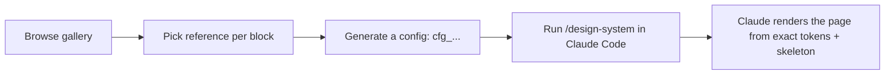

# design-reference — Claude Code plugin

**Pick a real UI, not a token guess.**

`design-reference` is a Claude Code plugin that turns "make it look modern" into
"make it look exactly like Stripe's header and Linear's hero." You pick real
production websites as references for each UI block, and the plugin hands Claude
the exact design tokens (color, type, radii, shadows, motion) and structural
skeleton for each one — composed into one coherent page with a shared anchor,
not a blended "kind of Stripe-ish" guess.

Instead of one generic aesthetic direction for the whole page, you control the
visual language **per block**: header from one reference, hero from another,
each keeping its own structure and signature.

## Why

Generic AI UI generation produces the same "AI-slop" landing page every time.
`design-reference` attacks the root cause: **Claude codes against your chosen
references' actual tokens and skeletons**, not a vague prompt. The result is
measurably closer to the reference (see our benchmark) and doesn't drift into
formulaic layout.

## How it works



1. **Browse the [reference gallery](https://design-reference-web.vercel.app/gallery)** — curated, real production references (header, hero, dashboard, footer).
2. **Pick one reference per block.** Star one to anchor the page's colors, type, radii, and shadows; every other block keeps its own structure.
3. **Generate a config** (`cfg_...`) and copy the command.
4. **Run `/design-system <cfg_id>` in Claude Code.** Claude loads the design system and generates the page — no extra prompts, no drift.

> Want to swap just one block later? `design-reference` persists the config and
> can replace a single header or hero without touching the rest of the page.

## Install

```bash
# 1. Install the plugin from the marketplace
claude plugin install design@design-reference

# 2. Point the plugin at the hosted MCP server (once)
#    set DESIGN_REFERENCE_MCP_URL=https://design-reference-web.vercel.app/api/mcp
#    or follow the "Connect" flow in Claude Code when prompted
```

Then generate a config in the [gallery](https://design-reference-web.vercel.app/gallery)
and run `design-reference /design-system <cfg_id>` in your project.

### Requirements

- Claude Code (recent version)
- A [design-reference](https://design-reference-web.vercel.app) account to save configs (browsing the gallery is free, no account needed)

## Privacy

`design-reference` sends only the reference ids you picked to the MCP server —
your project code, prompts, and generated files stay local to your Claude Code
session. Your codebase is never uploaded.

## References library

Currently curated per block type:

| Block   | References |
|---------|------------|
| header  | Stripe, Vercel, Airbnb, Figma, Mailchimp, Notion |
| hero    | Figma, Framer, Linear, Mailchimp, MotionSites, Notion |
| dashboard | MotionSites dashboard UI, Nimbus demo |
| footer  | MotionSites Lumina, Vize |

The library is growing — new references are added on a rolling basis.

## Smith

- **Product in docs:** [design-reference-web](https://github.com/sslinNn/design-reference-web) (web app + MCP server)
- **Benchmark:** see `docs/BENCHMARK_RESULTS.md` in the web repo — design-reference vs plain Claude across 5 landing-page briefs.
- **License:** MIT (or your preference — say so and I'll add it).

---

Made by [@sslinNn](https://github.com/sslinNn). Found it useful? Star the repo
and share a before/after — it helps more than anything.
